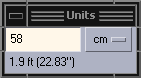

A simple unit widget written in C with GTK+ 3.

I would prefer if everyone used the metric system, but the American in me
has been conditioned to be able to attach more real-world meaning to lengths
and distances when they are expressed in feet.

This is a tool I wrote for two primary reasons:

* To teach myself some basics about programming a GTK3 UI in C (I am tired of
Python's slow start-up times).
* To act as a cheat-sheet when I need to understand a distance more
conceptually/visually in my mind.
